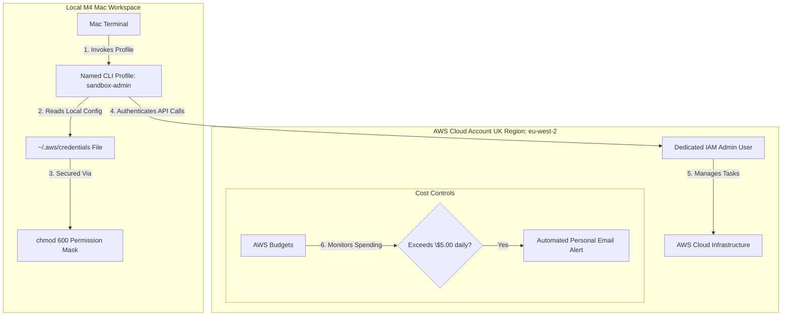

# DevOps Migration Project: Log Parser & AWS Landing Zone

A central repository demonstrating enterprise-grade DevOps engineering capabilities, featuring an automated Linux log parsing utility and a secured AWS cloud landing environment.

## 🛠️ Part 1: Linux Log Parser Script
This project includes a bash script (`log_parser.sh`) designed to scan system logs, extract error timestamps, and generate incident reports.

### Features
* Case-insensitive matching for "ERROR" logs using `grep`.
* Structured field extraction utilizing `awk`.
* Automated metric aggregation via `wc`.

### Usage
```bash
./log_parser.sh /path/to/your/logfile.log
```

## 📦 Part 2: Multi-Architecture Containerization (M4 Silicon Context)

To ensure this tool runs seamlessly across different cloud hardware tiers without triggering `exec format error` runtime crashes, the application targets both ARM64 (AWS Graviton) and AMD64/x86_64 (Intel/AMD) architectures.

### 🚀 Operational Workflows

#### 1. Fast Local Run & Testing (Single Platform)
```bash
docker compose up --build
```
* **Behavior:** Automatically detects the default `docker-compose.yml` to compile and run a native `linux/arm64` binary matching your Mac's M4 processor for rapid local feedback loops.

#### 2. Enterprise Production Run (Remote Registry Pull)
```bash
docker compose -f docker-compose.prod.yml up
```
* **Behavior:** Bypasses local builds entirely. It pulls your multi-architecture image manifest directly from Docker Hub and runs it with strict production resource allocations and security profiles. 
* *Note on Production Auth:* In real CI/CD pipelines or cloud infrastructure, authentication to private repositories is handled non-interactively via environment secrets or cloud-native IAM Roles/Credential Helpers rather than manual prompts.

#### 3. Ready to Ship Multi-Architecture Builds
```bash
docker login
docker buildx create --name enterprise-builder --use
docker buildx inspect --bootstrap
docker buildx build --platform linux/amd64,linux/arm64 -t your-dockerhub-username/log-parser:v1 --push .
```
* **Behavior:** Docker Buildx streams two parallel builds using the QEMU kernel emulation engine to yield a unified index tag containing both architecture variants.

---

## ☁️ Part 3: AWS Security & Identity Architecture

To support this project and all future automated deployments, a secure AWS sandbox environment was established following modern enterprise cloud security and cost optimization standards.

### Security Layout



### Security & Governance Guardrails Implemented

* **Programmatic Environment Isolation:** Configured an isolated, named local CLI profile (`sandbox-admin`). This completely replaces the use of high-risk root credentials for daily task automation, ensuring the master root email account remains isolated from all terminal operations.
* **Local Credential Hardening:** Applied an explicit `chmod 600` file system access mask to the local `~/.aws/credentials` directory. This restricts host-level visibility so that only the authenticated macOS user can read the static API tokens, safeguarding the workspace from background process leaks.
* **Financial Governance & Cost Optimization:** Formed a strict **$5.00 daily threshold budget** with automated email alerting triggers. Activating a global multi-account AWS Organization structure was intentionally avoided to protect and maintain active Free Tier credits while operating within the local UK region (`eu-west-2`).
