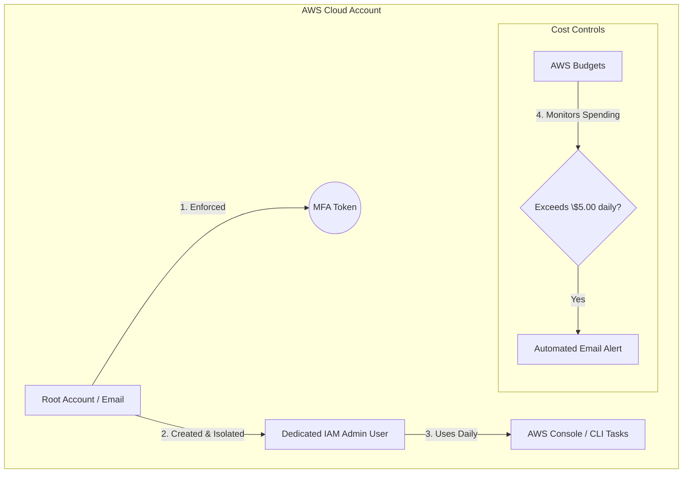

# DevOps Migration Project: Log Parser & AWS Landing Zone

A central repository demonstrating initial DevOps engineering capabilities, featuring an automated Linux log parsing utility and a secured AWS cloud environment.

## 🛠️ Part 1: Linux Log Parser Script
This project includes a bash script (`log_parser.sh`) designed to scan system logs, extract error timestamps, and generate incident reports.

### Features
* Case-insensitive matching for "ERROR" logs using `grep`.
* Structured field extraction utilizing `awk`.
* Automated metric aggregation via `wc`.

### Usage
```bash
./log_parser.sh /path/to/your/logfile.log
```

---

## ☁️ Part 2: AWS Security & Identity Architecture

To support this and future deployment utilities, a secure AWS sandbox environment was established following cloud security best practices.

### Security Layout



### Infrastructure Layout & Guardrails
* **Root Account Hardening:** Enforced Multi-Factor Authentication (MFA) on the root email account. The root account is strictly locked down and isolated from daily operations.
* **Identity & Access Management (IAM):** Created a dedicated administrative user with tailored permissions for day-to-day configuration tasks, eliminating root credential exposure.
* **Financial Governance (AWS Budgets):** Established a strict **$5.00 daily budget threshold** linked to automated email alerts to prevent runaway infrastructure costs during testing.

